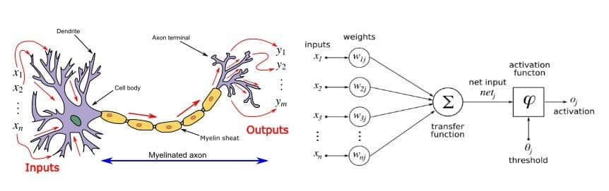
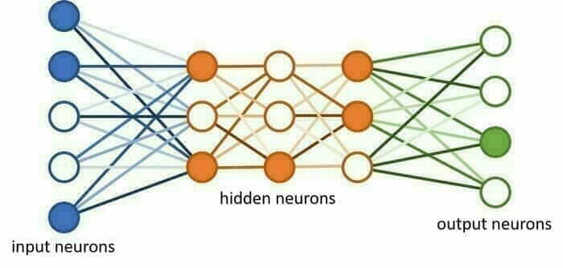
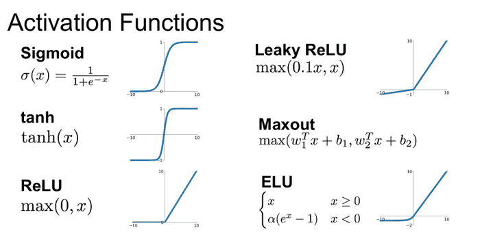
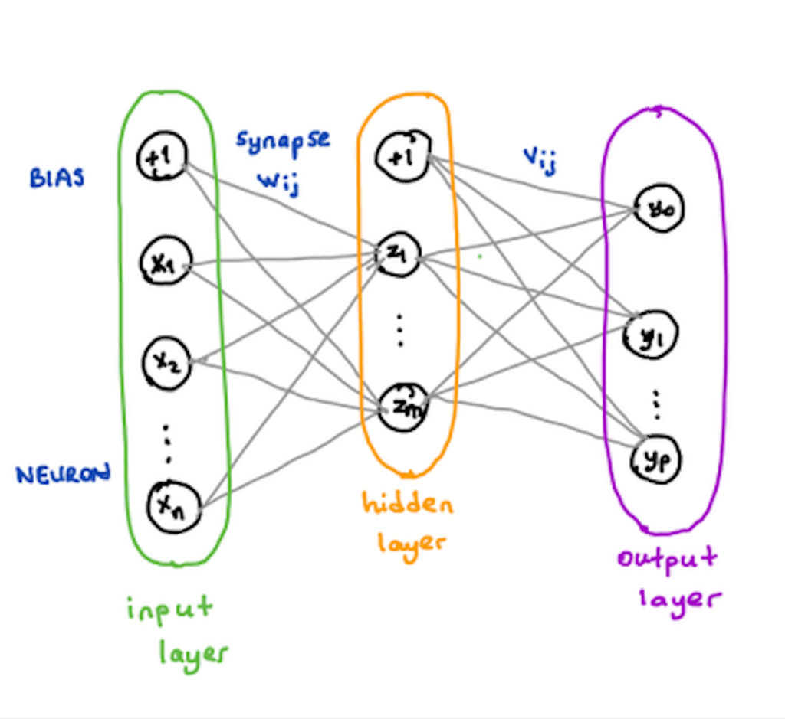

# **Module 1 - Implémentation d'un RNN (Recurrent Neural Network)**

Bienvenue dans ce projet d'implémentation d'un **réseau de neurones récurrent (RNN)** ! Ce document présente une introduction au concept des réseaux de neurones, leur fonctionnement, et comment nous avons utilisé ces principes pour implémenter un modèle d'apprentissage avec des **récompenses** et **pénalités**. 

---

## 🤔 Qu'est-ce qu'un réseau de neurones ?

Un **réseau de neurones** (ou Artificial Neural Network, ANN) est un modèle inspiré du fonctionnement du cerveau humain. 🧠 Dans un réseau biologique, plusieurs neurones travaillent ensemble pour recevoir des signaux d'entrée, traiter les informations et déclencher un signal de sortie.

Les **réseaux de neurones artificiels** sont des modèles mathématiques qui effectuent des calculs complexes à partir de données d'entrée pour produire une sortie. Grâce à des algorithmes, ces réseaux peuvent **apprendre** de leurs expériences passées et s'améliorer au fil du temps. 

Les réseaux de neurones sont utilisés dans de nombreux domaines de l'intelligence artificielle, comme la **vision par ordinateur**, **l'analyse de données temporelles** (séries chronologiques), et bien sûr, **les chatbots** et **les assistants vocaux**.

---

## 🔍 Neurones biologiques vs neurones artificiels

### Neurones biologiques :
Dans le cerveau, les neurones sont interconnectés par des synapses qui transmettent des informations sous forme d'impulsions électriques.

### Neurones artificiels :
Les neurones dans un réseau de neurones artificiel sont **des fonctions mathématiques**. Chaque neurone reçoit une entrée, effectue un calcul, puis transmet une sortie.

---

## 💡 Composants d'un réseau de neurones

### 1. **Les neurones** 🧠
Les neurones d'un réseau de neurones traitent les données d'entrée et génèrent des sorties. Ils sont organisés en **couches** (layers). Il y a généralement trois types de couches :
- **Couche d'entrée** : Les neurones de cette couche reçoivent les données brutes.
- **Couche cachée** : Traitement des informations avant la sortie finale.
- **Couche de sortie** : Donne la sortie du réseau.

### 2. **Les poids et biais** 🔢
Les **poids** sont des valeurs numériques qui ajustent l'importance des entrées dans le calcul des sorties. Les **biais** sont ajoutés pour ajuster le résultat de manière plus flexible.

### 3. **Les fonctions d'activation** 🔧

Les fonctions d'activation transforment les sorties des neurones avant de les transmettre aux couches suivantes. Par exemple, une fonction populaire est la **ReLU** (Rectified Linear Unit), qui aide à accélérer l'entraînement du modèle.

---

## 🛠️ Comment fonctionnent les réseaux de neurones ?

Le fonctionnement d'un réseau de neurones peut être décrit par trois étapes principales :

1. **Calcul du produit des entrées et poids** : Chaque neurone reçoit une entrée, la multiplie par son poids.
2. **Ajout du biais** : Un biais est ajouté pour ajuster le calcul.
3. **Application de la fonction d'activation** : Cette fonction décide si la sortie du neurone sera activée.

Ces étapes sont répétées à travers les couches pour produire la sortie finale.

---

## 🧠 **Réseaux de neurones récurrents (RNN)**

Les **RNN** sont des réseaux de neurones spécialisés dans le traitement des **séries temporelles** ou des **séquences de données**. Contrairement aux réseaux traditionnels, un RNN peut "se souvenir" des informations passées grâce à des connexions qui bouclent sur elles-mêmes. Cela le rend particulièrement utile pour des tâches comme la prévision de séries chronologiques ou la prédiction de mots dans les chatbots.

### 🏁 Exemple d'application : Simulation de conduite autonome
Dans ce projet, l'objectif est de simuler un **véhicule** qui se déplace sur une route. La voiture doit naviguer d'un coin supérieur gauche à un coin inférieur droit, tout en maximisant ses **récompenses** pour atteindre ces coins tout en évitant les **pénalités** (par exemple, si elle touche les bords de la route). 🎮

---

## 🔄 Processus d'apprentissage du RNN

Le modèle RNN utilise un mécanisme d'**apprentissage par renforcement**, où :
- **Récompenses** sont attribuées lorsqu'une action est réussie (ex : atteindre un coin de la route).
- **Pénalités** sont imposées si la voiture touche les bords de la route.

Grâce à **la rétropropagation** et l'**apprentissage par renforcement**, le modèle améliore progressivement ses performances pour naviguer correctement sur la route.

---

## 🎯 **Récompenses et pénalités dans l'apprentissage**

Voici comment cela fonctionne :
- Chaque fois que la voiture atteint un coin de la route, elle reçoit une **récompense** 🏆.
- Si elle quitte la route ou touche les bords, elle subit une **pénalité** ❌.
- L'objectif est d'apprendre à naviguer de manière optimale pour accumuler le plus de récompenses tout en minimisant les pénalités.

